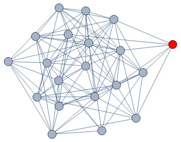

<h1 align="center">
  
</h1>

<!-- ## Hey, I'm Dhruv 👋 -->
🔬 I'm a grad student at Columbia University studying Operations Research & Analytics.  
🎓 Graduated from University of California, BS Mathematical Analytics & Statistics   
💻📚 I'm passionate about decision making, predictive analytics & mathematical programming!

###

  

###

  
  
  
  
  
  
  
  
  
  
  
  
  

  

 <!--
## 📦 Toolbox

**Frontend Development:** `React` `Next.js` `TypeScript` `Tailwind` `Material-UI` `Framer-Motion`
 
**Version Control:** `Git` `GitLab` `Bitbucket`

**Backend Development:** `Nest.js` `GraphQL` `Firebase` 

**Testing:** `Cypress` `Playwright` `Vitest` `Postman` `Insomnia`

**Others:** `Storybook` `Zustand` `A11y` `Scrum` `Confluence` `Jira`
-->

<!-- 
## ✨ Fun Facts 

- Demon Slayer is my favorite anime.
- As a kid, I wanted to be an astronaut.
- I love using Mac after switching from Linux.
-->

###
<!--
## 🔥 My Stats

###

     
    

-->

###

## 📫 Contact

* Connect with me on [LinkedIn](https://www.linkedin.com/in/dhruvpjani/)
* Have a look at my personal [website](www.dpjani.github.io)
* Excited to collaborate on projects! 
 

<!--
**optimizedLP/optimizedLP** is a ✨ _special_ ✨ repository because its `README.md` (this file) appears on your GitHub profile.

Here are some ideas to get you started:

- 🔭 I’m currently working on ...
- 🌱 I’m currently learning ...
- 👯 I’m looking to collaborate on ...
- 🤔 I’m looking for help with ...
- 💬 Ask me about ...
- 📫 How to reach me: ...
- 😄 Pronouns: ...
- ⚡ Fun fact: ...
-->
